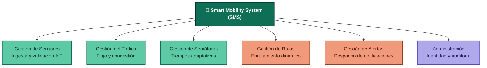
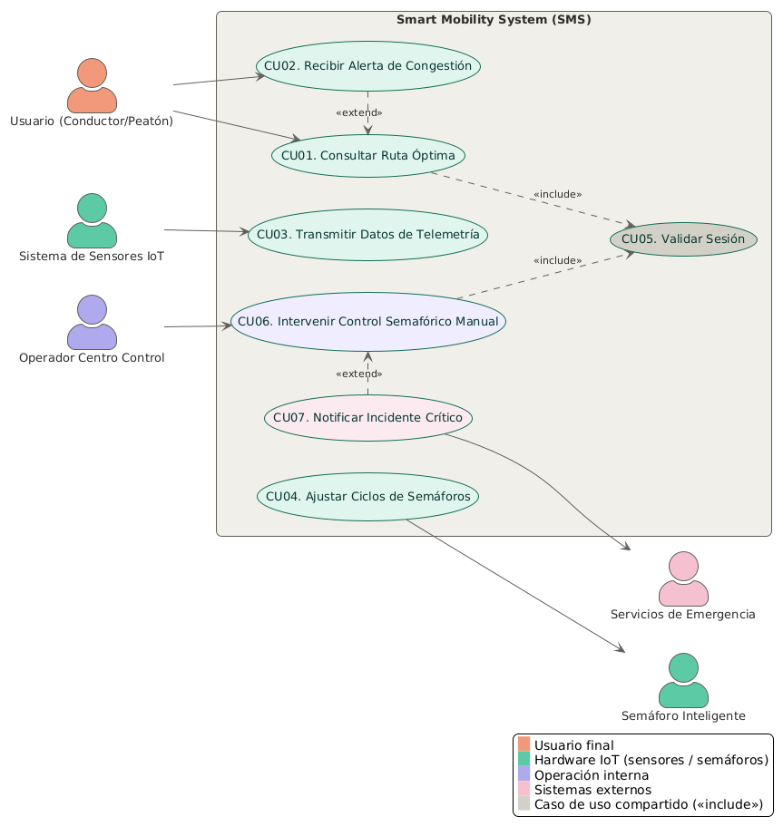
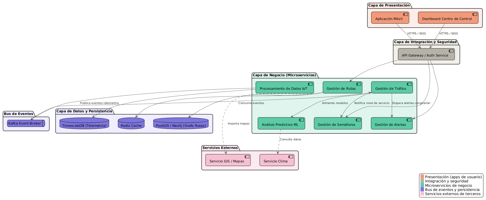
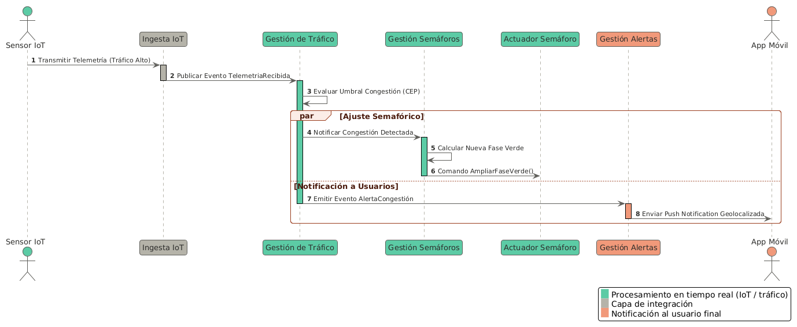
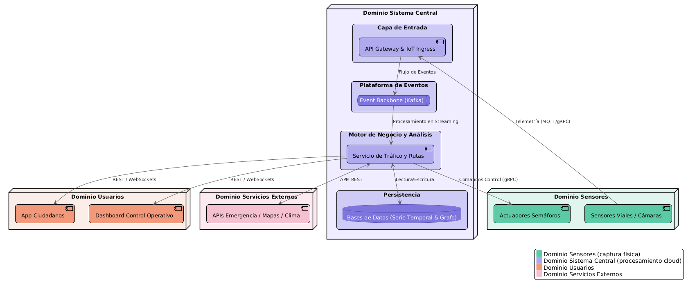
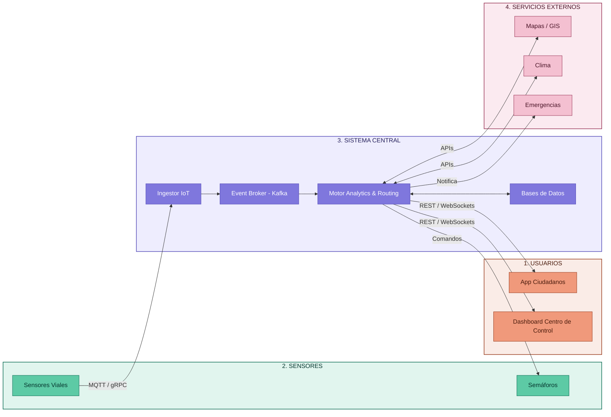

# 🚦 Smart Mobility System (SMS)

**Proyecto:** Sistema Inteligente de Movilidad Urbana (Smart Mobility System)
**Asignatura:** Arquitectura de Software
**Entregable:** Taller de Modelado y Representación Arquitectónica
**Integrantes:** Jhonathan Salazar Muñoz

---

## Introducción

Este repocitorio tiene el desarrollo completo del taller de Arquitectura de Software, donde se diseño un sistema de movilidad urbana inteligente. La idea: usar datos de sensores, semáforos y apps para que el tráfico de una ciudad fluya mejor, se avise a la gente de congestiones a tiempo, y las emergencias se atiendan más rápido.

---

## Descripción del sistema

El SMS es una plataforma orientada a eventos (Event-Driven) que:

- Recibe telemetría en tiempo real de cámaras, sensores de flujo y semáforos.
- Detecta congestión y ajusta automáticamente los ciclos de los semáforos.
- Calcula rutas óptimas para conductores y peatones, y las recalcula si algo cambia en el camino.
- Manda alertas push a los usuarios cerca de un incidente, y avisa a policía/ambulancias cuando hace falta.

Todo pensado para que aguante carga alta, no se caiga fácil, y siga funcionando aunque se pierda la conexión con el servidor central (las intersecciones pueden operar solas por un rato, en modo edge).

El sistema se divide en 6 módulos que hacen cada uno lo suyo:



---

## Cómo está organizado el repo

```
smart-mobility-architecture/
├── README.md                  <- este archivo
├── docs/
│   ├── docs_fase1-requisitos.md    <- qué debe hacer el sistema (RF y RNF)
│   ├── dosc_fase2-analisis.md      <- quiénes lo usan y qué problemas resuelve
│   ├── docs_fase3-vistas-arquitectonicas.md        <- los diagramas técnicos (casos de uso, componentes, secuencia, macro)
│   └── docs_fase4-analisis-critico.md  <- por qué se diseñó así, reflexión final
└── diagrams/
    ├── src/
    │   ├── vista-casos-de-uso.puml
    │   ├── vista-logica.puml
    │   ├── vista-procesos.puml
    │   └── vista-conceptual.puml
    └── renders/
        ├── vista-casos-de-uso.png
        ├── vista-logica.png
        ├── vista-procesos.png
        └── vista-conceptual.png
```

Cada `fase*.md` corresponde a una etapa del taller.

---

## Diagramas (4 vistas)

Las 4 vistas siguen el modelo 4+1 de Kruchten, y todas comparten la misma paleta de colores para que se lea de forma coherente saltando de una a otra: **verde** = procesamiento en tiempo real / IoT, **naranja** = cara al usuario final, **morado** = operación interna / control, **rosa** = sistemas externos de terceros.

### 1. Vista de casos de uso



### 2. Vista lógica (componentes)



### 3. Vista de procesos (secuencia)



### 4. Vista conceptual (macro)





> Los `.png` se generan a partir de los `.puml` en `diagrams/src/` (se pueden renderizar con PlantUML, el plugin de VS Code, o [plantuml.com/plantuml](http://www.plantuml.com/plantuml/uml/)). Los diagramas Mermaid de esta página se renderizan solos en GitHub.

---

## Explicación de cada vista

- **Casos de uso** → Muestra qué puede hacer cada actor con el sistema: el usuario pide rutas y recibe alertas, los sensores mandan telemetría, el operador puede intervenir manualmente un semáforo, y cuando hay un incidente crítico se avisa a los servicios de emergencia.
- **Vista lógica** → Es la foto de "quién hace qué" a nivel de software: presentación (app, dashboard) → gateway → microservicios de negocio → bus de eventos → persistencia → integraciones externas. Cada capa tiene una responsabilidad clara y no se pisa con las demás.
- **Vista de procesos** → Sigue paso a paso un escenario real: un sensor detecta tráfico alto, el sistema evalúa si es congestión, y en paralelo ajusta el semáforo y manda una alerta push. Es la vista que muestra la concurrencia y el orden de los eventos.
- **Vista conceptual** → El mapa grande: cuatro dominios (Usuarios, Sensores, Sistema central y Servicios externos) y cómo se conectan entre sí. Sirve para entender dónde vive cada pieza sin meterse en el detalle de código.

---

## Análisis final

¿Por qué 4 vistas en vez de un diagrama gigante? Porque nadie entiende un diagrama que intenta mostrar todo a la vez. Cada vista responde una pregunta distinta:

- **Casos de uso** → ¿qué debe hacer el sistema?
- **Vista lógica** → ¿quién lo hace (qué componente)?
- **Vista de procesos** → ¿cómo y cuándo colaboran esos componentes?
- **Vista conceptual** → ¿dónde vive todo esto, a nivel infraestructura?

Se complementan como capas superpuestas: los casos de uso definen el alcance, la vista lógica lo traduce en componentes, la vista de procesos muestra cómo esos componentes colaboran en el tiempo, y la vista conceptual enmarca todo dentro de los límites físicos y tecnológicos reales.

La parte más complicada de modelar fue la **vista de procesos** (diagrama de secuencia), porque el sistema es asíncrono por naturaleza — nada de esperar una respuesta antes de seguir, todo se dispara por eventos. Coordinar eso sin bloquear la ingesta de sensores ni retrasar las respuestas a la app móvil, cumpliendo los tiempos que pedían los requisitos, fue lo que más costó plasmar en el diagrama.

---

## Conclusiones

- Una **arquitectura orientada a eventos** con microservicios es la que mejor encaja para este tipo de sistema: permite meter miles de sensores mandando datos sin bloquear nada, y cumplir con la latencia exigida (menos de 500ms).
- Definir bien los requisitos funcionales y no funcionales desde el arranque fue lo que guió el diseño hacia una arquitectura desacoplada, con Kafka como columna vertebral de eventos.
- Modelar en múltiples vistas, todas con la misma identidad visual, deja el diseño listo para comunicarse con distintos públicos (devs, arquitectos, operadores) sin perder coherencia entre ellas — y deja la puerta abierta para sumar cosas nuevas más adelante (como modelos predictivos con IA) sin tener que rediseñar todo de cero.

---

## 🚀 Instrucciones de Despliegue / Visualización

Para previsualizar y editar los diagramas de este proyecto:

1. Instala la extensión **Mermaid Preview** en Visual Studio Code o utiliza [Mermaid Live Editor](https://mermaid.live).
2. Clona el repositorio:
   ```bash
   git clone https://github.com/usuario/smart-mobility-system.git
   cd smart-mobility-system
   ```
3. Realiza tus modificaciones y sube tus commits siguiendo la convención [Conventional Commits](https://www.conventionalcommits.org/).

---

## 📄 Licencia

Este proyecto se distribuye bajo la licencia **MIT**. Consulta el archivo `LICENSE` para más detalles.