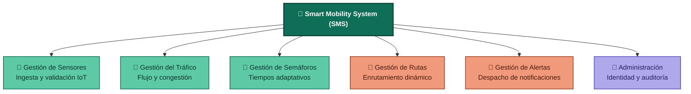

# Fase 1: Especificación de Requisitos del Sistema

## 1. Identificación de Módulos Funcionales

El sistema se organiza en **6 módulos funcionales desacoplados** diseñados para operar de forma distribuida e independiente:

*Leyenda: verde = procesamiento en tiempo real (sensores, tráfico, semáforos) · naranja = interacción con el usuario final (rutas, alertas) · morado = administración y gobernanza del sistema.*

1. **Módulo de Gestión de Sensores (MGS):** Responsable de la ingesta de telemetría IoT, validación de integridad, normalización de datos y filtrado de ruido.
2. **Módulo de Gestión del Tráfico (MGT):** Procesa el flujo vehicular instantáneo, calcula niveles de servicio (LOS) y detecta cuellos de botella e incidentes en tiempo real.
3. **Módulo de Gestión de Semáforos (MGSem):** Calcula y aplica planes de tiempos adaptativos en intersecciones viales con base en la densidad detectada.
4. **Módulo de Gestión de Rutas (MGR):** Motor de enrutamiento dinámico que calcula caminos óptimos considerando incidentes, congestión y preferencias multimodales.
5. **Módulo de Gestión de Alertas (MGA):** Genera, prioriza y canaliza alertas push a usuarios móviles y notificaciones de emergencia a entidades externas.
6. **Módulo de Administración del Sistema (MAS):** Gestiona identidades, control de acceso basado en roles (RBAC), parámetros globales de configuración y logs de auditoría inmutables.

---

## 2. Requisitos Funcionales (RF)

| Módulo | ID | Descripción del Requisito Funcional | Prioridad |
| :--- | :--- | :--- | :--- |
| **Gestión de Sensores** | `RF01` | El sistema debe recibir y procesar transmisiones de telemetría provenientes de cámaras, bucles inductivos y dispositivos GPS en intervalos de tiempo parametrizables ($< 5\ \text{s}$). | Alta |
| | `RF02` | El sistema debe autenticar y validar la firma digital e integridad de los paquetes transmitidos por los dispositivos IoT antes de ser procesados. | Alta |
| **Gestión del Tráfico** | `RF03` | El sistema debe calcular el índice de congestión y velocidad promedio por segmento de red vial cada 30 segundos. | Alta |
| | `RF04` | El sistema debe identificar cuellos de botella automáticos utilizando algoritmos de Procesamiento de Eventos Complejos (CEP). | Alta |
| **Gestión de Semáforos** | `RF05` | El sistema debe ajustar los ciclos de semáforos (duración de luz verde) en tiempo real en función del volumen de tráfico detectado. | Alta |
| | `RF06` | El sistema debe permitir la invalidación manual de ciclos semafóricos por parte de los operadores del Centro de Control en situaciones de emergencia. | Crítica |
| **Gestión de Rutas** | `RF07` | El sistema debe calcular la ruta óptima para conductores/peatones evaluando el estado del tráfico, cierres viales e imprevistos. | Alta |
| | `RF08` | El sistema debe recalcular dinámicamente la ruta activa de un usuario en tránsito si las condiciones de su trayecto se deterioran. | Media |
| **Gestión de Alertas** | `RF09` | El sistema debe despachar alertas geolocalizadas a los usuarios dentro del área de influencia de un incidente vial. | Alta |
| | `RF10` | El sistema debe despachar automáticamente notificaciones estructuradas a los sistemas de urgencias y policía ante accidentes confirmados. | Crítica |
| **Administración** | `RF11` | El sistema debe gestionar identidades, roles y permisos de acceso para operadores y administradores. | Alta |
| | `RF12` | El sistema debe guardar registros inmutables (*audit logs*) de cada acción o cambio de configuración ejecutado por personal del sistema. | Alta |

---

## 3. Requisitos No Funcionales (RNF)

* **RNF01 - Alta Disponibilidad:**
  - El sistema debe mantener una disponibilidad operacional del **99.9%** (tiempo fuera de servicio no mayor a 8.76 horas/año).
  - Debe desplegarse en arquitectura multizona activo-activo con conmutación por error (*failover*) transparente.

* **RNF02 - Tiempos de Respuesta y Latencia:**
  - Ingesta y procesamiento de eventos de sensores: latencia end-to-end $< 500\ \text{ms}$.
  - Cálculo y respuesta de rutas desde la aplicación móvil: tiempo de respuesta $< 2.0\ \text{s}$ para el percentil 95 ($p_{95}$).
  - Actualización de fases semafóricas en el actuador físico: $< 1.0\ \text{s}$ desde la emisión de la instrucción.

* **RNF03 - Seguridad y Privacidad:**
  - Comunicaciones en tránsito cifradas mediante protocolo **TLS 1.3**.
  - Autenticación mutua (**mTLS**) para dispositivos de red IoT.
  - Autenticación de usuarios y aplicaciones mediante **OAuth 2.0 / OpenID Connect** con tokens **JWT** de corta duración.
  - Anonimización de telemetría recibida desde dispositivos móviles de usuarios para cumplir con normativas de protección de datos personales (GDPR/Habeas Data).

* **RNF04 - Escalabilidad Horizontal:**
  - La arquitectura debe soportar escalado horizontal automático (*auto-scaling*) en la capa de servicios e ingesta.
  - La plataforma debe absorber un incremento del **300%** en la carga de eventos en horas pico sin degradación en los tiempos de respuesta.

* **RNF05 - Tolerancia a Fallos e Aislamiento:**
  - Implementación de patrones **Circuit Breaker** y **Bulkhead** para prevenir fallos en cascada.
  - Si la conexión central colapsa, las intersecciones inteligentes deben mantener operativa una política de control local autónomo (*Edge Computing*).