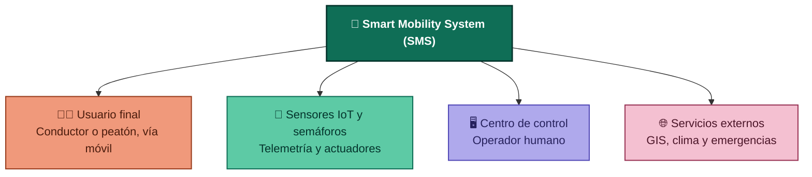

# Fase 2: Análisis del Sistema

Documento de análisis de actores, dominio del problema y restricciones operacionales para el **Smart Mobility System (SMS)**.

---

## 1. Identificación de Actores

El sistema interactúa con actores humanos, dispositivos físicos y plataformas externas:

*Leyenda: naranja = usuario final · verde = infraestructura IoT en campo · morado = operación interna · rosa = sistemas externos de terceros.*

### 1.1 Actores Principales
* **Usuario Final (Conductor / Peatón):**
  - Consume servicios de cálculo de rutas dinámicas.
  - Recibe notificaciones push sobre eventos de tráfico, congestiones u obras.
  - Aporta telemetría anónima de velocidad y ubicación durante el tránsito.

* **Operador del Centro de Control:**
  - Monitorea el mapa térmico de movilidad de la ciudad en tiempo real.
  - Invalida temporalmente automatizaciones semafóricas para responder a eventos especiales o pasos de emergencia.
  - Declara e ingresa manualmente reportes de incidentes viales.

### 1.2 Actores Dispositivos / Hardware
* **Sistema de Sensores IoT:**
  - Cámaras de visión artificial con conteo vehicular integrado.
  - Bucles inductivos magnéticos y radares de velocidad.
  - Emite datos continuos de telemetría a la capa de ingesta central.

* **Actuador Semafórico Inteligente:**
  - Recibe comandos de temporización y planes de fase emitidos por la central.
  - Reporta su estado operativo y diagnósticos de fallos eléctricos/mecánicos.

### 1.3 Actores Sistemas Externos
* **Servicio de Cartografía y Mapas (GIS):** Suministra la topología de la red vial, capas geográficas y restricciones físicas de la ciudad.
* **Servicio Meteorológico:** Proporciona datos de precipitaciones y visibilidad para alimentar el modelo predictivo de congestión.
* **Agencias de Emergencia (Policía / Ambulancias / Bomberos):** Sistemas externos que reciben notificaciones automáticas de incidentes graves para coordinar la atención.

---

## 2. Matriz de Problemas que Resuelve el Sistema

| Problema Urbano Actual | Causas Raíz | Solución Arquitectónica en SMS |
| :--- | :--- | :--- |
| **Congestión severa en horas pico** | Tiempos semafóricos estáticos sin capacidad de respuesta al tráfico real. | Algoritmos de optimización adaptativa que modifican ciclos de luz verde según la demanda instantánea. |
| **Retraso de vehículos de emergencia** | Imposibilidad de despejar corredores viales de manera prioritaria. | Función de "Ola Verde" controlada desde el Centro de Control o activada por GPS de ambulancias/policía. |
| **Rutas desactualizadas en navegadores** | Información de incidentes no centralizada o reportada de forma tardía. | Procesamiento en tiempo real (*CEP*) que recalcula rutas activas inmediatamente al detectar obstrucciones. |
| **Falta de visibilidad operativa** | Monitoreo fragmentado y no automatizado de la infraestructura vial. | Dashboard unificado con telemetría unificada en tiempo real de todos los nodos IoT urbanos. |

---

## 3. Restricciones del Sistema

1. **Restricción de Tiempo Real Estricto:** La ingesta de datos y la actualización semafórica no pueden depender de procesos por lotes (*batch*); requieren un motor de *Streaming Analytics*.
2. **Conectividad Intermitente en Edge:** Las redes viales sufren cortes de red móvil o fibra. El software de intersección debe operar autónomamente cuando pierda comunicación con el servidor central.
3. **Heterogeneidad de Hardware:** La ciudad cuenta con sensores y semáforos de múltiples marcas y épocas. El sistema requiere una capa de abstracción de adaptadores y protocolos (MQTT, Modbus, HTTP, gRPC).