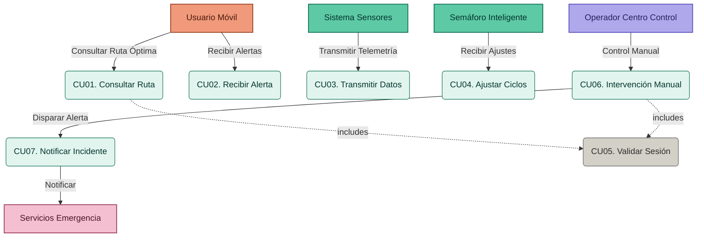
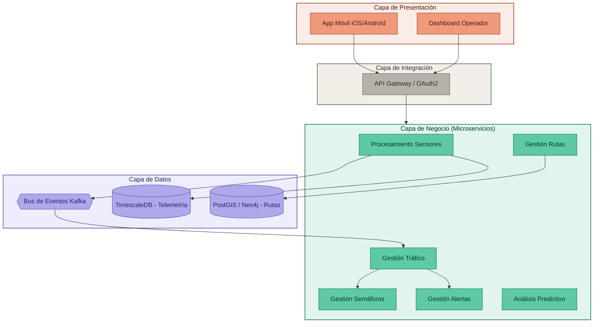
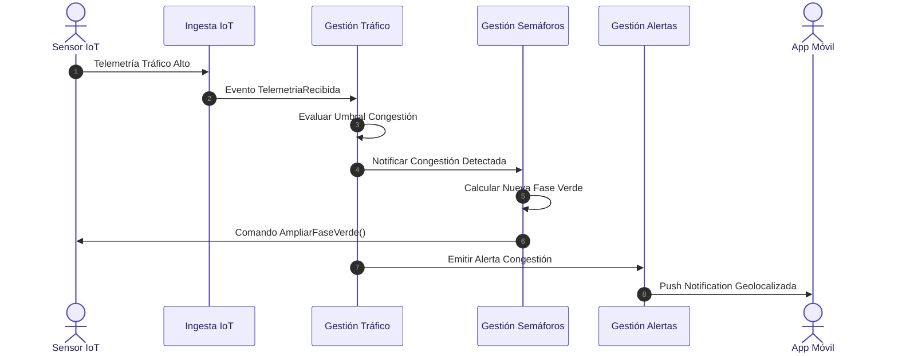
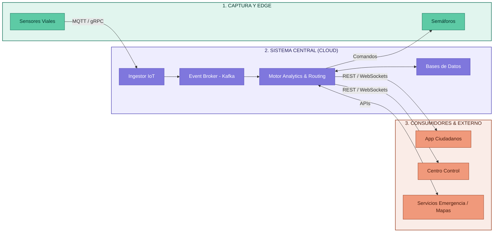

# Fase 3: Construcción de Vistas Arquitectónicas

Especificación y modelos visuales para la representación del **Smart Mobility System (SMS)**.

---

## 1. Vista de Casos de Uso (UML)

La Vista de Casos de Uso define el comportamiento del sistema desde el punto de vista de los actores involucrados.

### Especificación de Casos de Uso Clave

* **CU01 - Consultar Ruta Óptima:**
  - *Actor:* Usuario Móvil.
  - *Propósito:* Obtener la ruta con menor tiempo estimado de llegada (ETA) considerando congestiones e imprevistos.
  - *Inclusiones:* `CU05. Validar Sesión`.

* **CU03 - Transmitir Datos de Telemetría:**
  - *Actor:* Sistema de Sensores IoT.
  - *Propósito:* Enviar ráfagas de datos con conteo de vehículos, velocidad promedio y ocupación de carril.

* **CU04 - Ajustar Ciclos de Semáforos:**
  - *Actor:* Semáforo Inteligente / Módulo de Gestión.
  - *Propósito:* Recibir y ejecutar las instrucciones de modificación de tiempo de luz verde emitidas por el sistema central.

* **CU06 - Intervenir Control Semafórico Manual:**
  - *Actor:* Operador del Centro de Control.
  - *Propósito:* Forzar el estado de un semáforo o crear un corredor verde prioritario ante emergencias.

---

## 2. Vista Lógica (Diagrama de Componentes)

Estructura estática organizada por capas y módulos desacoplados mediante interfaces de integración.

---

## 3. Vista de Procesos (Diagrama de Secuencia)

Flujo dinámico e interacciones asíncronas para el escenario: **Detección de Congestión y Generación Automática de Alertas con Ajuste Semafórico**.

---

## 4. Vista Conceptual (Diagrama Macro)

La "gran fotografía" del ecosistema **Smart Mobility System** relacionando dominios físicos y lógicos.

